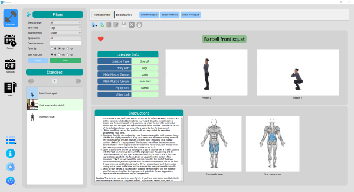
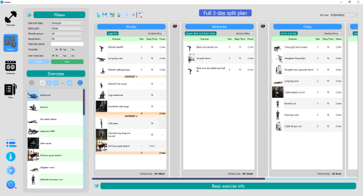
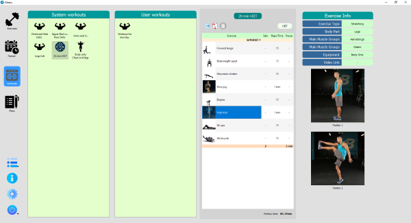
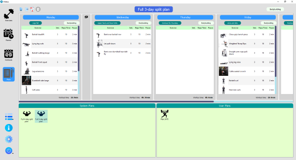

# Motus #
A python desktop application for creating workouts and week workout plans.
  
Release(v1.0) is available.

## Table of contents
* [Images](#images)
* [Features](#features)
* [Requirements](#requirements)
* [License](#license)
* [TODO](#todo)

## Images
  
<i>Tab exercises</i>

  
<i>Tab planner</i>

  
<i>Tab workouts</i>

  
<i>Tab Plans</i>

## Features
* Exercise library with over 800 exercises. New exercises can be added, edited and deleted.
* Planner tables pane(7 tables for each day of the week) for creating week plans or workouts
* Workout and plan library
* Exporting workouts and plans to PDF
* Export workout/plan to a file
* Import workout/plan from a file
* Settings for setting: font, start display, icon size, folder paths.
* Send feedback e-mail to developers 

## Requirements
The following software and libraries are required to run Motus:
* Windows 10
* Python 3.9 or newer
* PyQt5 5.15.6
* reportlab 3.6.9
* cryptography 36.0.2
* requests 2.27.1
* Pillow 9.1.0
* pytest 7.1.1(only if you want to run tests)
* pytest-qt 4.0.2(only if you want to run tests)

## License
Distributed under the GNU Affero General Public License. See LICENSE file for more information. 
NOTE: Images and data not to be used for commercial purposes.
    

## TODO
* Add new plans and workouts
* Add documentation
* Add more tests
